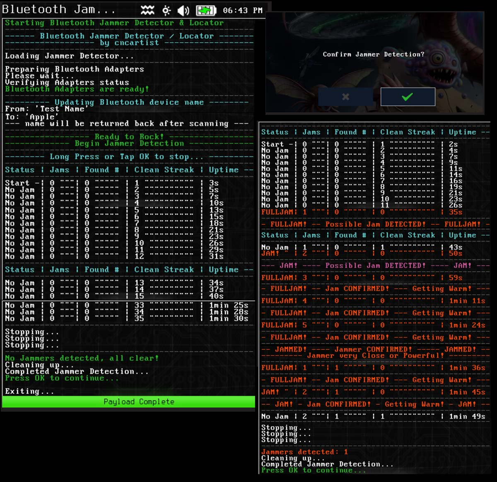
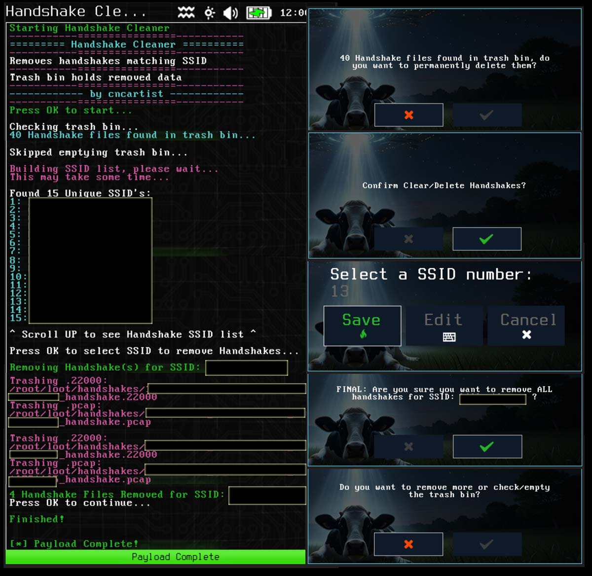
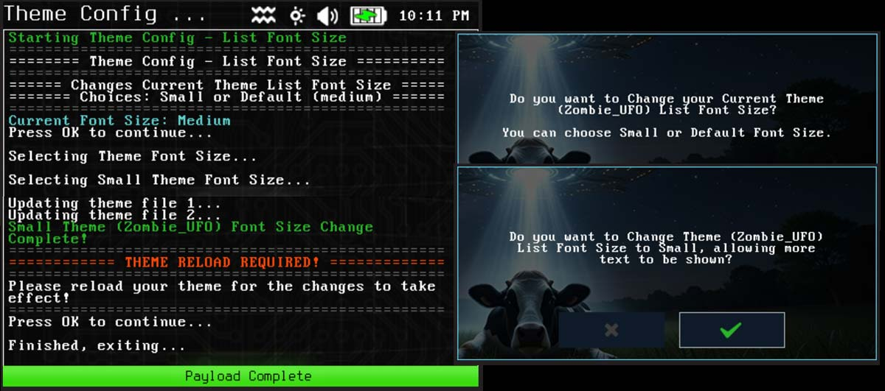
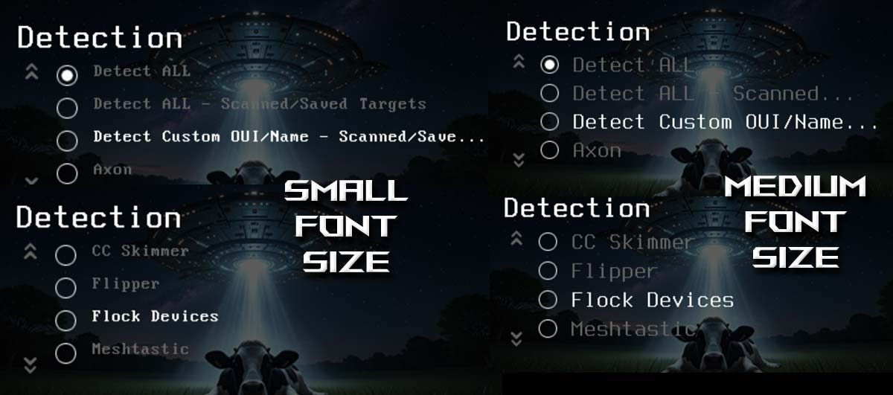

# WiFi-Pineapple-Pager-Payloads
# Bluetooth Scanning + Tools, USB Ducky Data Stream Capture, Disable All Alerts, Handshake Cleaner, USB Enable Storage Devices, and Theme Config.  For Hak5 WiFi Pineapple Pager.

The [BluePine Bluetooth Scanning Suite](https://github.com/cncartistsec/BluePine-WiFi-Pineapple-Pager) includes all of the below Bluetooth Scanners + Tools in one payload and will receive more frequent updates.  The Bluetooth payloads below are a sample of the individual tools/payloads in [BluePine](https://github.com/cncartistsec/BluePine-WiFi-Pineapple-Pager).

# Bluetooth Device Hunter (bt-device-hunter)

Bluetooth Device Hunter (Classic + LE combined or separate).  Data builds over time in case name or manufacturer is missed on first scans.  Custom configuration allowed.  Verbose logging / debugging / mute / privacy mode available.

# Bluetooth Config MAC USB (bt-cfg-tool-mac)
Bluetooth MAC Address Changer for USB CSR8510 / CSR v4.0 Bluetooth Adapter.  Tool will act on hci1 by default and has been tested to work on various CSR8510 Bluetooth Adapters (range from $5-10).  Can also permanently change Alias/Name for specific MAC as an option, or restore the old name before change.  Boot the pager first before plugging in USB BT Adapter to ensure it gets hci1 instead of hci0.

# Bluetooth Config Discov/Name (bt-cfg-tool)
Bluetooth Discoverable Setting Changer + Bluetooth Hardware Name Changer.  Can change both USB + Internal Settings.

# Bluetooth Jammer Detector / Locator (bt-jammer-detect)

Detects & Locates Bluetooth Jammers/Interference Devices within close range.  Required to have a USB Bluetooth Adapter to utilize the connection between internal and external Bluetooth.  The stronger the jammer/interference, the more easily it will be found.  Even a weak jammer can cause signal outages in devices, but it takes a very strong interference or being very close (at most 4-6 ft away from source) to interrupt the connection between the internal Bluetooth and external USB Bluetooth.

# Bluetooth PineFlipKill - WiFi Pineapple, Flipper, and USB Kill Scanner (bt-pineflipkill-scan)

WiFi Pineapple BT / Flipper Zero / USB Kill BT Scanner.  Allows scanning with external USB Bluetooth adapter.

# USB Ducky / Flipper Scanner & Data Stream Capture (usb-ducky-flipper)

Hak5 USB Rubber Ducky / Bad USB / Flipper Zero USB Scanner & Data Stream Capture.  Use Pagers USB A port for testing, not USB C.  This tool will capture and decode the key inputs for a keyboard like device and save the output of what was being sent in a data stream text file.

Outputs (ascii art + powershell):

# USB Enable Storage Devices / Mass Media (usb-enable-mass-media)
Tool will create hotplug file that enables mass media/USB storage devices for Pager, or allow it to be removed.  Devices will be mounted to /usb/ by default and no reboot is required.  Thanks to dark_pyrro for research and documentation on the fix.

# Disable All Alerts (sys-cfg-alerts-off)

Lists and Turns All Enabled Alerts Off.  Asks before turning off and shows count/names.

# Handshake Cleaner (handshake-cleaner)

Clears/Deletes Handshakes matching SSID, helpful to clean out unwanted SSIDs.

# Theme Config - List Font Size (theme-cfg-list-font)

Changes files relating to the list picker font size to be smaller, can return back to default.  Theme needs to be reloaded after changing to apply.

Comparing font sizes for list picker:

