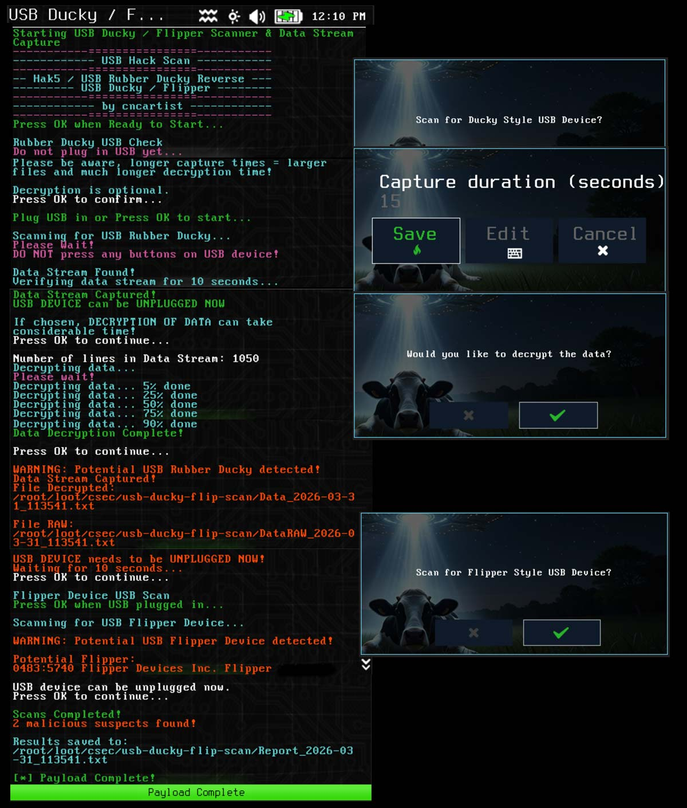
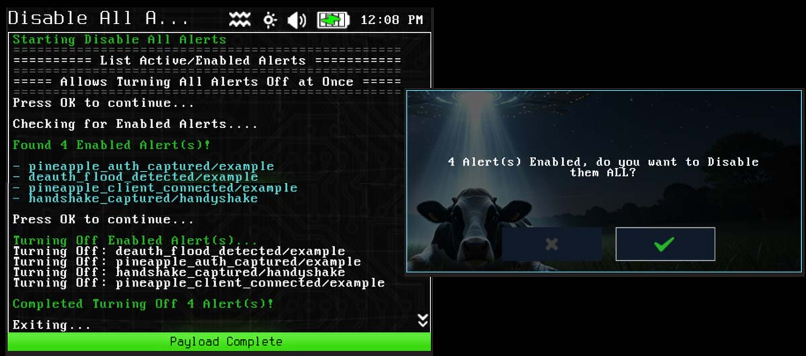

# WiFi-Pineapple-Pager-Payloads
Hak5 WiFi Pineapple Pager Payloads by cncartist

# Bluetooth Device Hunter (bt-device-hunter)

Bluetooth Device Hunter (Classic + LE combined or separate).  Data builds over time in case name or manufacturer is missed on first scans.  Custom configuration allowed.  Verbose logging / debugging / mute / privacy mode available.

# USB Ducky / Flipper Scanner & Data Stream Capture (usb-ducky-flipper)

Hak5 USB Rubber Ducky / Bad USB / Flipper Zero USB Scanner & Data Stream Capture.  Use Pagers USB A port for testing, not USB C.  This tool will capture and decode the key inputs for a keyboard like device and save the output of what was being sent in a data stream text file.

# Disable All Alerts (sys-cfg-alerts-off)

Lists and Turns All Enabled Alerts Off.  Asks before turning off and shows count/names.
